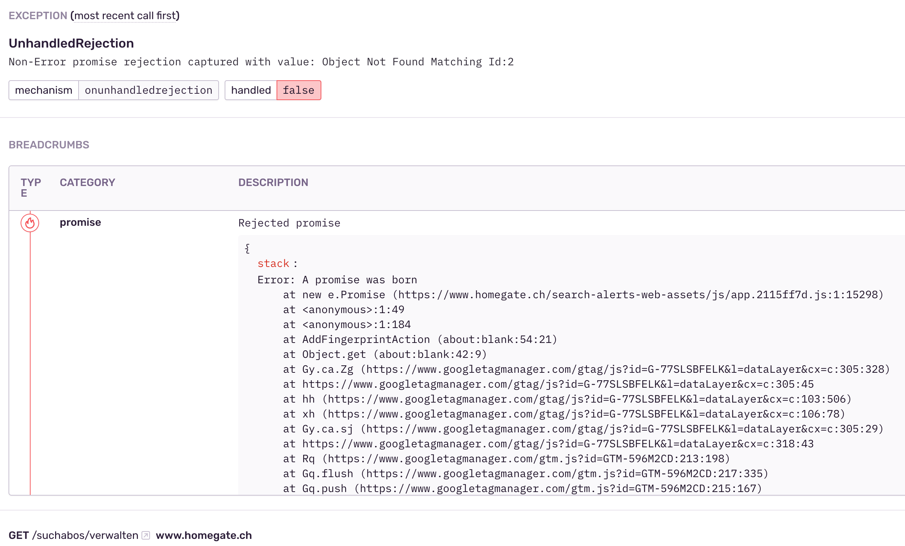

# sentry-promise-tracing
Sentry integration for tracking promises with unhandled rejections.

It uses [Sentry breadcrumbs](https://sentry.io/features/breadcrumbs/) to display information about the origin of 
the promise that has been rejected.

`PromiseTracing` support both NodeJS and browser environment and relies on `unhandledRejection` and `unhandledrejection` 
events respectively.

## Usage example

An example of integration usage could look like this:

```typescript
import * as Integrations from '@sentry/integrations/esm';
import * as Sentry from '@sentry/vue';
import { withPromiseTracing } from 'sentry-promise-tracing';
import Vue from 'vue';

export function sentryInit(dsn?: string, environment?: string, release?: string): void {
  if (dsn) {
    Sentry.init({
      dsn,
      environment,
      release,
      Vue: Vue,
      integrations: withPromiseTracing(
        [],
        [
          new Integrations.Vue({
            Vue,
            attachProps: true,
          }),
          new Integrations.ExtraErrorData(),
          new Integrations.Dedupe(),
        ]
      ),
    });
  }
}
```

`withPromiseTracing()` accepts two lists of additional integrations, `headIntegrations` and `tailIntegrations`, that
are wrapping around [default integrations](https://docs.sentry.io/platforms/javascript/configuration/integrations/default/),
that are passed to the [integration configuration function](https://docs.sentry.io/platforms/node/configuration/integrations/#removing-an-integration).

This function registers `PromiseTracing` integration first to override the default integration for 
[OnUnhandledRejection](https://docs.sentry.io/platforms/node/configuration/integrations/default-integrations/#onunhandledrejection).

## Breadcrumb example

The resulting breadcrumb will look like this:


